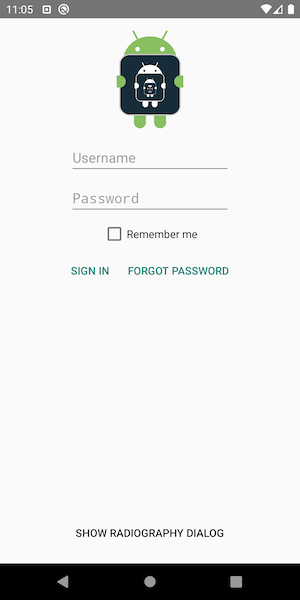

#  Radiography

[](https://search.maven.org/search?q=g:%22com.squareup.radiography%22)
[](https://www.apache.org/licenses/LICENSE-2.0)


Radiography provides a utility class to pretty print a view hierarchy.

## Usage

Add the `radiography` dependency to your app's build.gradle file:

```gradle
dependencies {
  implementation 'com.squareup.radiography:radiography:2.0.0'
}
```

`Radiography.scan()` returns a pretty string rendering of the view hierarchy of all windows managed by the current process.

```kotlin
// Render the view hierarchy for all windows.
val prettyHierarchy = Radiography.scan()

// Include the text content from TextView instances.
val prettyHierarchy = Radiography.scan(stateRenderers = DefaultsIncludingPii)

// Append custom attribute rendering
val prettyHierarchy = Radiography.scan(stateRenderers = DefaultsNoPii +
    viewStateRendererFor<LinearLayout> {
      append(if (it.orientation == LinearLayout.HORIZONTAL) "horizontal" else "vertical")
    })
```

You can print a subset of the view hierarchies.

```kotlin
// Extension function on View, renders starting from that view.
val prettyHierarchy = someView.scan()

// Render only the view hierarchy from the focused window, if any.
val prettyHierarchy = Radiography.scan(viewFilter = FocusedWindowViewFilter)

// Filter out views with specific ids.
val prettyHierarchy = Radiography.scan(viewFilter = SkipIdsViewFilter(R.id.debug_drawer))

// Combine view filters.
val prettyHierarchy = Radiography.scan(viewFilter = FocusedWindowViewFilter and MyCustomViewFilter())
```

## Result example



```
com.squareup.radiography.sample/com.squareup.radiography.sample.MainActivity:
window-focus:false
 DecorView { 1080×2160px }
 +-LinearLayout { 1080×2028px }
 | +-ViewStub { id:action_mode_bar_stub, GONE, 0×0px }
 | `-FrameLayout { id:content, 1080×1962px }
 |   `-ConstraintLayout { id:main, 1080×1962px }
 |     +-ImageView { id:logo, 1080×352px }
 |     +-EditText { id:username, 580×124px, text-length:4 }
 |     +-EditText { id:password, 580×124px, focused, text-length:4, ime-target }
 |     +-CheckBox { id:remember_me, 343×88px, text-length:11 }
 |     +-Button { id:signin, 242×132px, text-length:7 }
 |     +-Group { id:group, 0×0px }
 |     `-Button { id:show_dialog, 601×132px, text-length:23 }
 +-View { id:navigationBarBackground, 1080×132px }
 `-View { id:statusBarBackground, 1080×66px }
```

This sample app lives in this repo in the `sample` directory.

## FAQ

### What is Radiography useful for?

Radiography is useful whenever you want to look at the view hierarchy and don't have the ability to connect the hierarchy viewer tool. You can add the view hierarchy string as metadata to crash reports, add a debug drawer button that will print it to Logcat, and use it to improve Espresso errors ([here's an example](https://twitter.com/Piwai/status/1291771701584252928)).

### Is Radiography production ready?

The code that retrieves the root views is based on Espresso's [RootsOracle](https://github.com/android/android-test/blob/master/espresso/core/java/androidx/test/espresso/base/RootsOracle.java) so it's unlikely to break in newer Android versions. We've been using Radiography for crash reports in production since 2015 without any issue.

### Why use custom attribute string rendering instead of View.toString() ?

The output of `View.toString()` is useful but harder to read:

```
// View.toString():
Button { VFED..C.. ........ 0,135-652,261 #7f010001 app:id/show_dialog }
// Radiography:
Button { id:show_dialog, 652x126px, text-length:28 }
```

If you'd rather rely on `View.toString()`, you can provide a custom state renderer.

```kotlin
val prettyHierarchy = Radiography.scan(stateRenderers = listOf(viewStateRendererFor<View> {
  append(
      it.toString()
          .substringAfter(' ')
          .substringBeforeLast('}')
  )
}))
```

## License


<pre>
Copyright 2020 Square Inc.

Licensed under the Apache License, Version 2.0 (the "License");
you may not use this file except in compliance with the License.
You may obtain a copy of the License at

    http://www.apache.org/licenses/LICENSE-2.0

Unless required by applicable law or agreed to in writing, software
distributed under the License is distributed on an "AS IS" BASIS,
WITHOUT WARRANTIES OR CONDITIONS OF ANY KIND, either express or implied.
See the License for the specific language governing permissions and
limitations under the License.
</pre>
